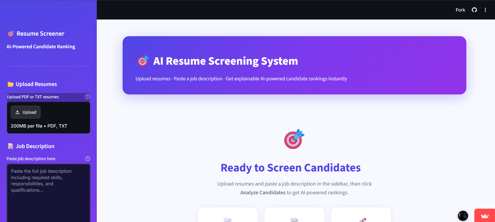

# 🤖 AI Resume Screener

<p align="left">


</p>

<p align="center">
  
</p>

An AI-powered resume screening system that analyzes resumes, matches them with job descriptions, ranks candidates based on relevance, identifies skill gaps, and provides visual insights to streamline the hiring process.

## 🚀 Live Demo

🔗 **Live Demo:** [Open AI Resume Screener](https://futureml03-wbcm7xwasqfv8jkngwgxv4.streamlit.app/)

---

## ✨ Features

- 📄 Upload resumes for analysis
- 📝 Compare resumes with job descriptions
- 🤖 AI-powered resume matching
- 📊 Resume match score generation
- 🏆 Candidate ranking
- 💡 Skill gap identification
- 📈 Interactive visual analytics
- ⚡ Easy-to-use Streamlit interface

---

## 🛠️ Tech Stack

- **Programming Language:** Python
- **Framework:** Streamlit
- **Machine Learning:** Scikit-learn
- **Natural Language Processing (NLP):** spaCy, NLTK
- **Data Processing:** Pandas, NumPy
- **Data Visualization:** Plotly
- **PDF Processing:** PyMuPDF
- **Report Generation:** ReportLab

---

## 📂 Project Structure

```
AI-Resume-Screener/
│── src/
│── streamlit_app.py
│── scorer.py
│── ranker.py
│── preprocessor.py
│── report.py
│── visualizer.py
│── skills_db.json
│── requirements.txt
│── .gitignore
```

---

## 🔮 Future Improvements

- Support DOCX and additional resume formats
- AI-powered resume improvement suggestions
- Recruiter login and dashboard
- Resume history and analytics
- ATS compatibility checking
- Export reports in PDF format
- Integration with Gemini/OpenAI APIs

---

## 🤝 Contributing

Contributions are welcome!

1. Fork this repository
2. Create a new branch
3. Commit your changes
4. Open a Pull Request

---

## ⚙️ Installation

1. Clone the repository

```bash
git clone https://github.com/debraniprl-wq/AI-Resume-Screener.git
```

2. Navigate to the project folder

```bash
cd AI-Resume-Screener
```

3. Install dependencies

```bash
pip install -r requirements.txt
```

4. Run the application

```bash
streamlit run streamlit_app.py
```

## ▶️ Usage

1. Launch the Streamlit application.
2. Upload one or more resumes in PDF format.
3. Enter the job description.
4. Click **Analyze**.
5. View resume scores, candidate rankings, skill gaps, and visual insights.


## 📄 License

This project is created for learning and educational purposes.

---

⭐ If you found this project useful, consider giving it a star.
